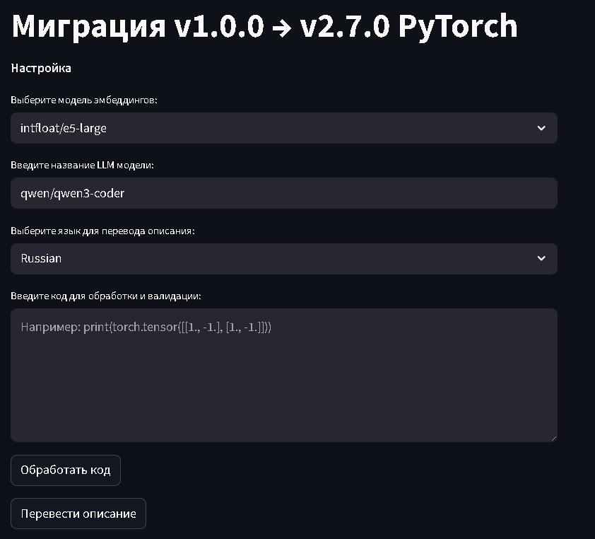

# RAG_pyTorch_migration

Проект для миграции системы Retrieval-Augmented Generation (RAG) с PyTorch v1.0.0 на v2.7.0. RAG сочетает возможности поиска релевантных документов с генерацией текста, используя современные LLM и векторные базы данных. Подробнее о RAG можно прочитать в [статье на Хабре](https://habr.com/ru/articles/779526/).(Скриншоты веб приложения представлены ниже)

## Особенности 

* Интеграция [LangChain](https://python.langchain.com/docs/introduction/) в связки с [HuggingFaceEmbeddings](https://huggingface.co/models)
* Векторная база данных [QDrant](https://qdrant.tech/)
* Работа с API LLM через [openrouter](https://openrouter.ai/)
* Миграция на PyTorch v2.7.0 получаем код от пользователя, выдаём новый код.
* [Streamlit](https://docs.streamlit.io/) для создания UI

## Структура проекта
``` text
RAG_pyTorch_migration/
├── data/                  # Примеры документов и наборов данных
├── documents/             # Рекомендации по установке и настройке
├── llm/                   # Функции для работы с LLM
├── logs/                  # Логи и настройка логера
├── parsing/               # Модуль для скачивания данных и разбиения на чанки
├── retrival/              # модуль кетривал который отвечает за взаимодействие с DB
|                                # и загрузку embed модели
├── ui/                    # Приложение на streamlit
├── validator/             # Валидатор для проверки работоспособности кода
├── .gitignore        
├── main.py                # Пример полного пайплайна 
├── main_jup.py            # Блокнот с представлением проекта
├── testing_differen_params.py  # Блок для тестирования
└── README.md  
```


## Требования 

* conda окружение torch100 - для валидации кода на версии 1.0.0
* conda окружение torch270 - для валидации кода на версии 2.7.0
* файл .env в корне проекта с OPENROUTER_API
* база данных QDrant(по умолчанию подключается к локальному контейнеру с адресом `http://localhost:6333/`)

## Скриншоты

После выполнения команды 

```
streamlit run ui/app.py
```
Мы увидим вот такой интерфей, в котором мы можем выбрать модель эмбендингов и LLM модель, а так же язык для перевода ответа LLM.



После нажатия на кнопку "Обработать код" мы получим ответ от модели. Пример представлен на скриншоте ниже.


После нажатия на кнопку "Перевести описание" будет получен перевод ответа LLM на ранее выбранный язык. Пример представлен на скриншоте ниже.


